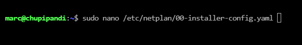
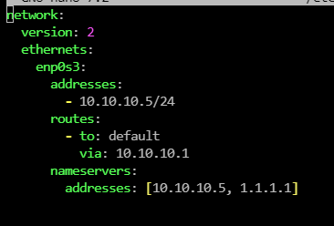
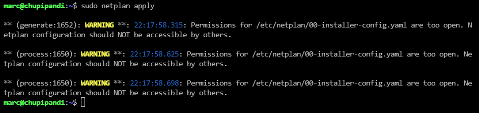
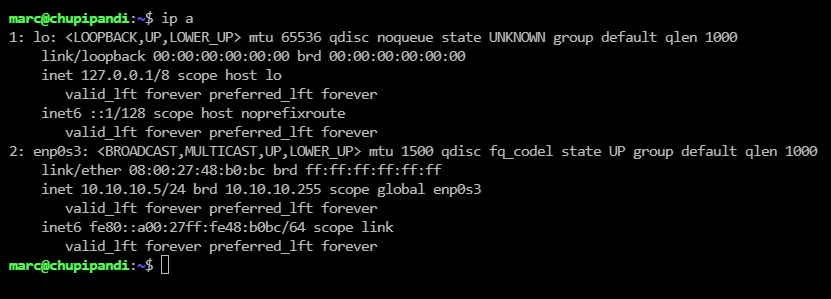
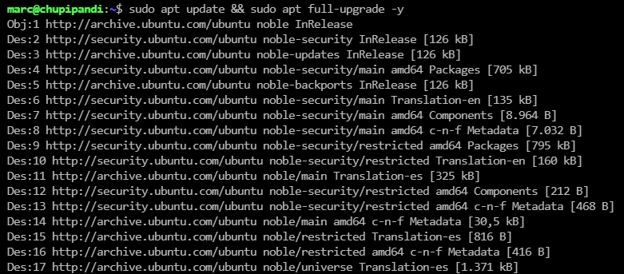
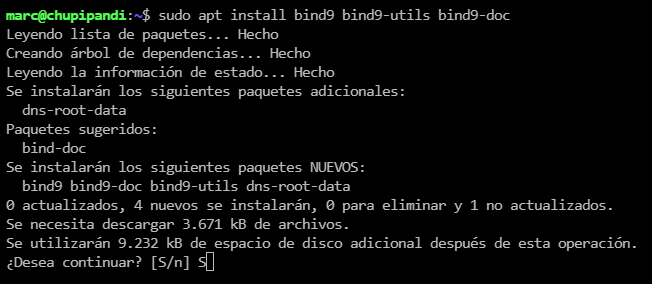
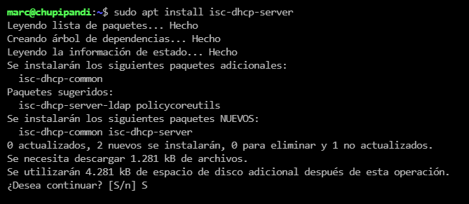
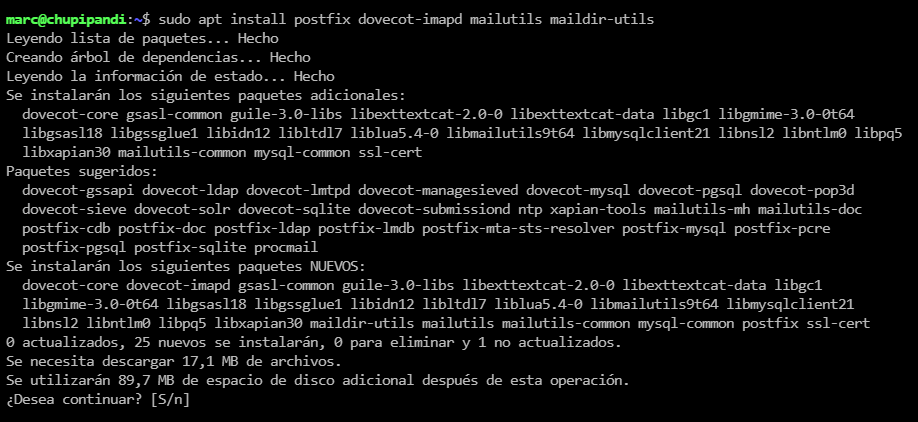
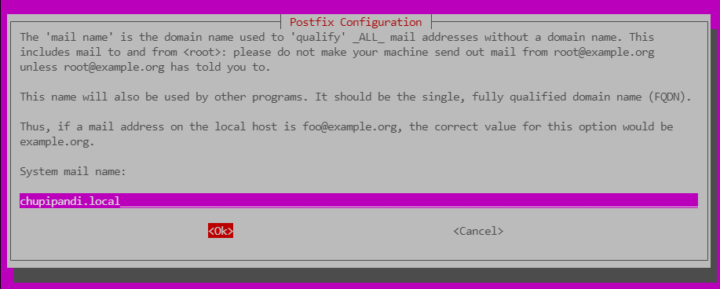

# Configuración de un Servidor DHCP, DNS y Correo en Ubuntu
Este documento detalla los pasos necesarios para configurar un servidor con servicios de DHCP, DNS y correo en un entorno Ubuntu Server. El objetivo es proporcionar una infraestructura de red funcional con asignación de direcciones IP dinámicas, resolución de nombres de dominio y gestión de correos electrónicos.

## Requisitos Previos

- Antes de comenzar, asegúrese de cumplir con los siguientes requisitos:

- Ubuntu Server instalado y configurado con una IP fija dentro del rango de la red local.

- Acceso con privilegios de superusuario.

- Conexión a internet para la instalación de paquetes.

- Dominio local configurado para el servicio de DNS y correo.

## Servicios a Configurar

- Servidor DHCP: Asignar direcciones IP dinámicas a los clientes de la red.

- Servidor DNS: Resolver nombres de dominio dentro de la red local.

- Servidor de Correo: Configurar Postfix y Dovecot para el envío y recepción de correos.

# Instalación y Configuración

A continuación, se detallan los pasos para la instalación y configuración de cada servicio.

## Configuración de a IP fija

- Deberemos editar el archivo `/etc/netplan/00-installer-config.yaml`
```bash
sudo nano /etc/netplan/00-installer-config.yaml
```


- Dentro deberemos configurar lo siguiente. 
```bash
network:
  version: 2
  ethernets:
    enp0s3: # Cambiar por tu adaptador de red
      addresses:
         - Tu-IP/mascara
      routes:
        - to: default
          via: Tu-Gatawey
      nameservers:
        addresses: [ 1.1.1.1, Tu-IP ]
```


Cuando todo este configurado salimos con `Ctrl` + `o` y `Ctrl` + `X`

- Una vez acabada la configuración de la IP fija ejecutaremos un `netplan apply` para confirmar la configuración exitosa. 

```bash
sudo netplan apply
```


- Ejecutamos un `ip a` y confirmamos que ya tenemos assignada la IP de manera fija. 
```bash
ip a
```



## Actualizaciones y instalaciones

- Primero de todo deberemos actualizar el equipo mediante la siguiente comanda. 
```bash
sudo apt update && sudo apt full-upgrade -y
```


- Instalamos bind9 para el servidor de DNS y algunos de sus paquetes.
```bash
sudo apt install bind9 bind9-utils bind9-doc -y
```



- Ahora deberemos instalar `isc-dhcp-server`
```bash
sudo apt install isc-dhcp-server -y
```



- Ahora procedemos a instalar `Postfix` `Dovecot` `Maildir` y `Mailutils`

```bash
sudo apt install postfix dovecot-imapd mailutils maildir-utils -y
```



- Nos va a salir un pop-up deberemos escojer la opción `Sitio de Internet` y tendremos que añadir nuestro dominio.



- Por ultimo debemos instalar opnssl
```bash
sudo apt install openssl
```


## Configuración de DHCP

- Editamos el archivo `/etc/default/isc-dhcp-server` y deveremos añadir al lado de `INTERACESv4=` nuestro adaptador de red. 
```bash
sudo nano /etc/default/isc-dhcp-server
```


- Hacemos un backup del archivo `dhcpd.conf`.
```bash
sudo cp /etc/dhcp/dhcpd.conf /etc/dhcp/dhcpd.conf.BKP
```


- Ahora editaremos el archivo anterior.
```bash
sudo nano /etc/dhcp/dhcpd.conf
```


- Eliminamos todo y agregamos lo siguiente. 
```bash
option domain-name "chupipandi.local";
option domain-name-servers ns1.chupipandi.local;

authoritative;

subnet 10.10.10.0 netmask 255.255.255.0 {
    range 10.10.10.100 10.10.10.200;
    option domain-name-servers 10.10.10.5; #lo dejaremos configurado para poder usarlo como DNS
    option subnet-mask 255.255.255.0;
    option routers 10.10.10.1;
    option broadcast-address 10.10.10.255; #lo mismo con el broadcast
    default-lease-time 600;
    max-lease-time 7200;
}
```


- Ejecutamos un `dhcpd -t` para verificar la configuración. 
```bash
dhcpd -t
```


- Reiniciamos el servicio de dhcp
```bash
sudo systemctl restart isc-dhcp-server
```

- Comprobamos el estado del dhcp.
```bash
sudo systemctl status isc-dhcp-server
```


## Configuración DNS

- Editamos el archivo `named.conf.options` y añadimos lo siguiente. 
```bash
sudo nano /etc/bind/named.conf.options
```


```bash
// creamos ACL que permita solo el tráfico LAN de 10.10.10.10 - 10.10.10.255
options {
    listen-on { any; };
    directory "/var/cache/bind";
    allow-query { localhost; LAN; }; 
    recursion yes; 
    forwarders { 1.1.1.1; };
    
};

acl LAN {
    10.10.10.0/24;
};
```


Guardamos y cerramos con `Ctrl` + `o` y `Ctrl` + `x`

- Editamos el archivo `named` y añadimos en la linea `OPTIONS=` `-u bind -4`
```bash
sudo nano /etc/default/named
```


- Hacemos un `named-checkconf` al archivo `named.conf.options`
```bash
sudo named-checkconf /etc/bind/named.conf.options
```


- Reiniciamos el servicio de bind9 y verificiamos su estado
```bash
sudo systemctl restart bind9
systemctl status bind9
```


- Editamos el archivo `named.conf.local` y añadimos lo siguiente.
```bash 
sudo nano /etc/bind/named.conf.local
``` 


```bash
//zona directa
zone "chupipandi.local" in {
    type master;
    file "/etc/bind/zonas/db.chupipandi.local";
};

//Zona inversa
zone "10.10.10.in-addr.arpa" {
    type master;
    file "/etc/bind/zonas/db.10.10.10";
};

```

- Creamos el directorio de las dos zonas.
```bash 
sudo mkdir /etc/bind/zonas
```


- Copiamos el archivo `db.empty` cambiandole el nombre a `db.chupipandi.local` y el `db.127` cambiandole el nombre a `db.10.10.10`
```bash
sudo cp /etc/bind/db.empty /etc/bind/zonas/db.chupipandi.local
sudo cp /etc/bind/db.127 /etc/bind/zonas/db.10.10.10
```


- Editamos el archivo `db.chupipandi.local` y añadimos los siguiente.
```bash
sudo nano /etc/bind/zonas/db.chupipandi.local
```


```bash
$TTL    86400
@       IN      SOA     chupipandi.local. root.chupipandi.local. (
                              2024100701 ; Serial (Formato AAMMDDnn)
                              604800     ; Refresh (cada 7 días)
                              86400      ; Retry (cada 1 día)
                              2419200    ; Expire (28 días)
                              604800 )   ; Negative Cache TTL (7 días)
                              
; Registro NS
@       IN      NS      ns1.chupipandi.local.

; Registro A para el dominio base
@       IN      A       10.10.10.5

; Registros A adicionales
ns1        IN      A       10.10.10.5
www        IN      CNAME   chupipandi.local. ;Esto apuntara www.chupipandi.local a la IP del dominio base
mail       IN      A       10.10.10.5

; Registro MX para correos
@       IN      MX  10  mail.chupipandi.local.

; Cliente
client    IN      A  10.10.10.10

```


- Editamos el archivo `db.10.10.10` y añadimos los siguiente.
```bash
sudo nano /etc/bind/zonas/db.10.10.10
```


```bash
$TTL    604800 ;
@       IN      SOA     chupipandi.local. root.chupipandi.local. (
                        1               ; Serial
                        12h             ; Refresh
                        15m             ; Retry
                        3w              ; Expire
                        2h      )       ; Negative Cache TTL

;Registros de zona inversa
@       IN      NS      ns1.chupipandi.local.
ns1     IN      A       10.10.10.5

; Registros con IP servidor y 1 cliente
5       IN      PTR     ns1.chupipandi.local.
100      IN      PTR     client.chupipandi.local.
```


- Editamos el archivo `resolv.conf` y eliminamos todo y añadimos `nameserver IP-Servidor`


- Chekeamos que toda la configuracion este correcta.
```bash
sudo named-checkzone chupipandi.local /etc/bind/zonas/db.10.10.10
```


- Creamos un enlaze simboico de `resolv.conf`
```bash
sudo ln -sf /run/systemd/resolve/resolv.conf /etc/resolv.conf
```


- Reiniciamos el servicio de bind9
```bash
sudo systemctl restart bind9
```

- Comprobamos mediante `nslookup`
```bash
nslookup ns1.chupipandi.local
nslookup mail.chupipandi.local
```


## Configuración de Correo

- Creamos un backup del archivo `main.cf` y `10-mail.conf`
```bash
sudo cp /etc/postfix/main.cf /etc/postfix/main.cf.bkp
sudo cp /etc/dovecot/conf.d/10-mail.conf /etc/dovecot/conf.d/10-mail.conf.bkp
```


- Editamos el archivo main.cf y debemos añadir o modificar lo siguiente.
  - myhostname = mail.chupipandi.local
  - mydomain = chupipandi.local
  - myorigin = $mydomain
  - mydestination = $myhostname, chupipandi.local, chupipandi, localhost.localdomain, localhost
  - inet_interfaces = all
  - inet_protocols = all
  - home_mailbox = Maildir/


- Editamos el archivo ``10-mail.conf`` y modificar la siguiente linea.
```bash
mail_location = maildir:~/Maildir
```


### Creación de usuarios

